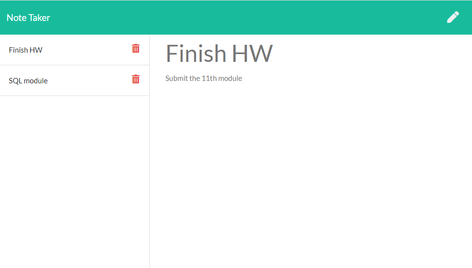

# Note Taker

Deployed application: https://shielded-garden-92330.herokuapp.com/

# Description

This online application is an note taker, developed with [Express](https://www.npmjs.com/package/express). It takes users input and stores the data in an online database. Each notes is assigned a short [UUID](https://www.npmjs.com/package/short-uuid). 

Since the app stores the info in an online database, the notes can be viewed and added on any computer.

# Change log

* Added server code, with modular route and library

* Fixed the front end javascript to works

* Note can be selected from the list on the left is now able to be selected much easier (no longer needed to click the letters specifically)